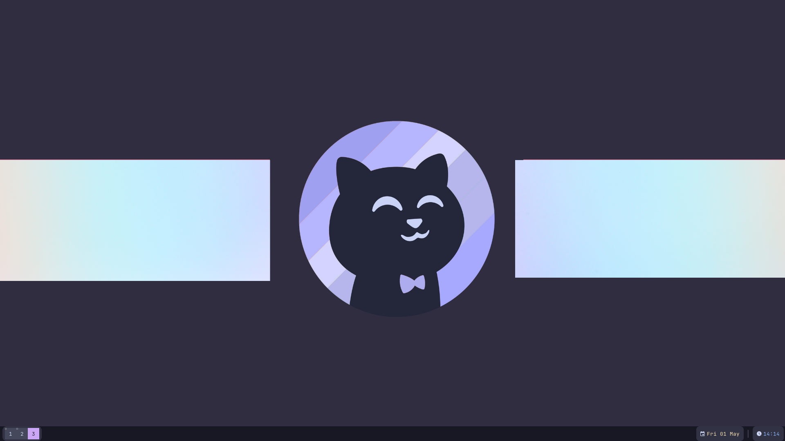

# Dotfiles+Installer for my minimalist Catpuccin Mocha Awesome dots

### In the cloned folder, there is an installer.sh in there that will back up all of your config and install my config.

# Image of desktop:

## Notes:
#### 1: These aren't heavily personalized dots, but the default layout is floating just cause that is what I like.

# Basic Keybinds

### Super+<1-3> opens given workspace according to number pressed
### Super+Space opens rofi
### Super+Return opens Kitty
### Super+X Kills active window
### Super+Control+R refreshes awesome config

#
#
#
#
#
#
#
#
##### If you like my work, thank you! you dont need to do anything lol just thanks
